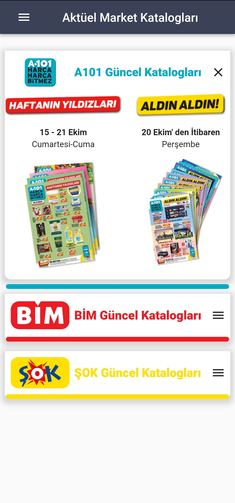
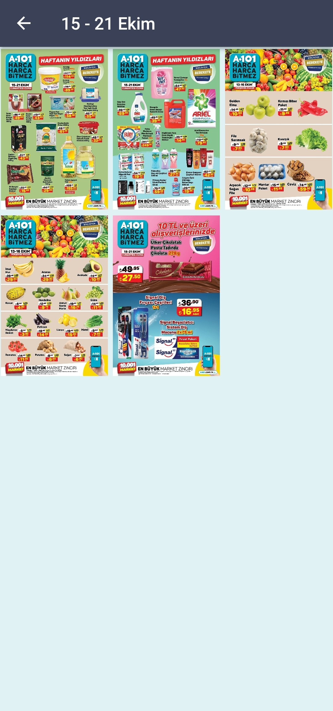
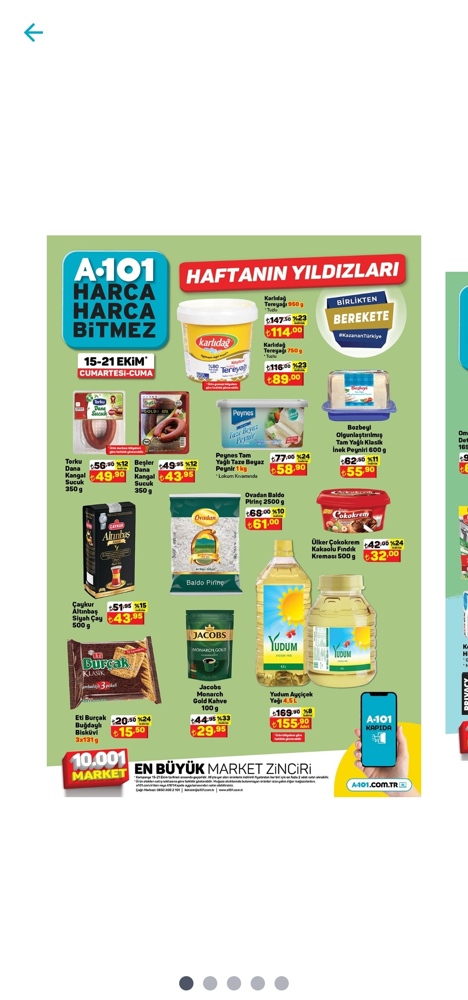
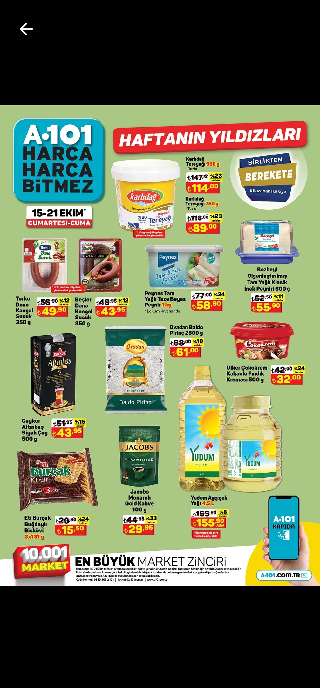
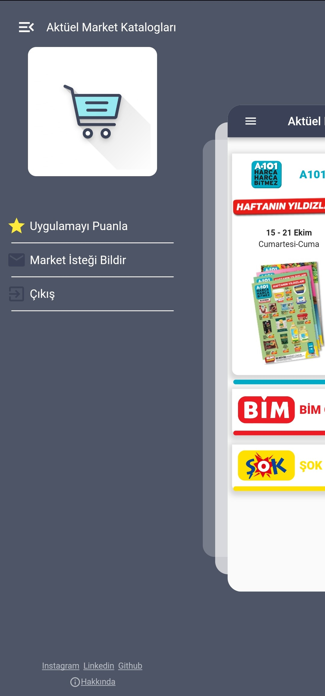

# AKTÜEL MARKET KATALOGLARI
Bim A101 ve Şok marketlerinin aktüel ürünlerinin listeleneceği, katalogların kolayca takip edilebileceği bir uygulama.

  

# Ana Sayfa
> AnimatedPadding
> CachedNetworkImage

Kullanışlı ve basit bir arayüz, bütün marketlere tek ekrandan ulaşın ve hangi katalogların yayınlandığını görün：

  

# Katalog Sayfaları

> GridView.builder

Seçilen kataloğun tüm sayfalarını tek ekranda görün ve istediklerinizi daha yakından inceleyin：

  

# Afiş Sayfası

Afişler arasında kolayca gezinin ve daha detaylı incelemek için tıklayın：
> CarouselSlider

  

# Detay Sayfası
> PhotoViewGallery.builder

Afişi yakınlaştırın, ürünleri daha yakından inceleyin：

  

# Drawer
> ZoomDrawer

Daha fazla seçenek ve iletişim için drawer menü'yü kullanın：

  

